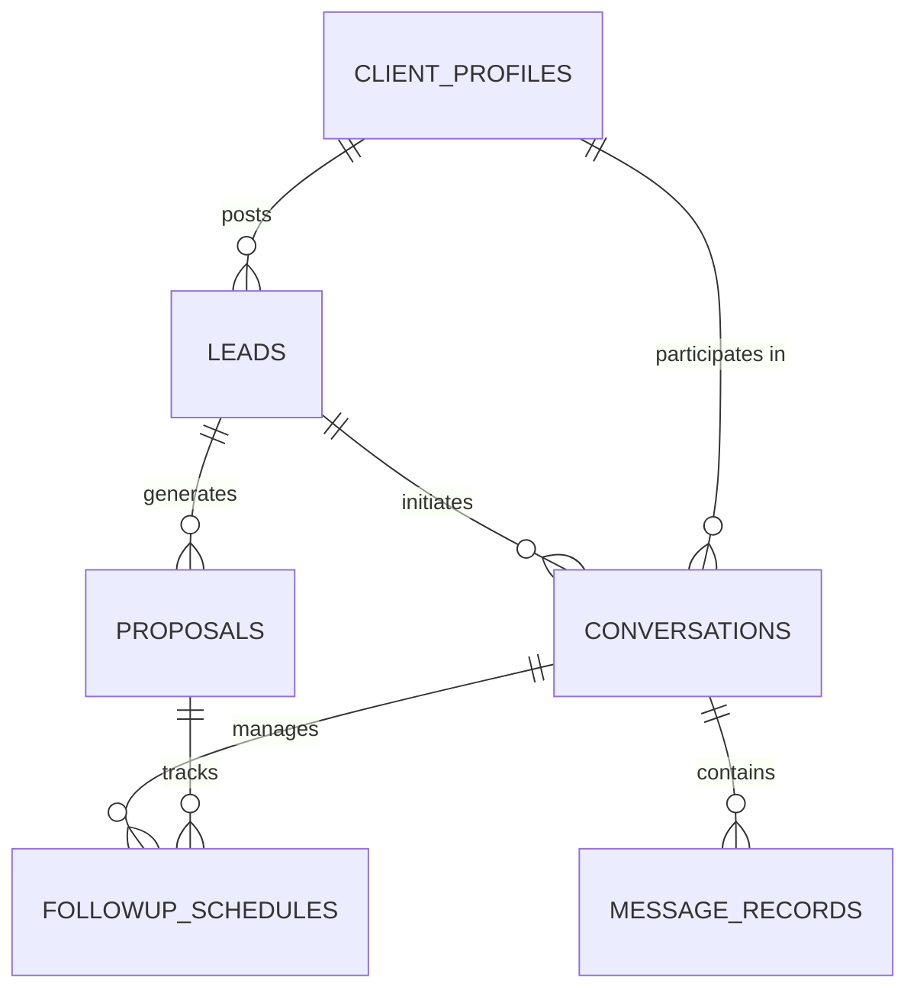

# Architecture & Data Models Reference
## Client Core Service (`CLIENT-CORE-SVC`)

---

## 1. Role & System Responsibility
The **Client Core Service (`CLIENT-CORE-SVC`)** (Port 8003) is the central persistent business-data repository and CRM for the entire client platform. It owns:

1. **Leads Store (`LeadModel`)**: Normalized opportunities with discovery source, budget, skills, score, classification, and lifecycle state (`discovered`, `qualified`, `contacted`, `replied`, `won`, `lost`).
2. **Clients & Organizations (`ClientProfileModel`)**: CRM client accounts with company details, website domains, verified contacts, confidence score, and lifetime interaction history.
3. **Conversations & Messages (`ConversationModel`, `MessageRecordModel`)**: Full message threads across outbound proposals, revisions, and incoming client replies with sentiment analysis.
4. **Proposals & Deal Terms (`ProposalModel`)**: Structured proposals, quotes, scope milestones, and win/loss audit logs.
5. **Follow-up State Machine (`FollowupScheduleModel`)**: Scheduled follow-up attempts with automated status transitions (`pending`, `executed`, `cancelled`).

---

## 2. Relational ER Diagram

